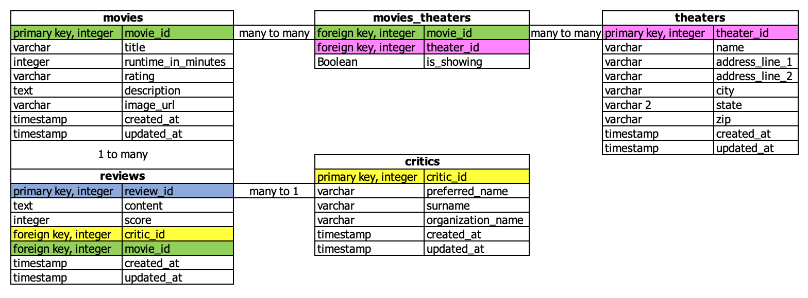

# WeLoveMovies
Backend project using express.js, express.Router, PostgreSQL, and Knex
written to complete the Thinkful capstone in module 42.

This server connects to a database containing 5 tables.
Here is the ERD I created:

Here are the endpoints:
**GET /movies** returns a list of all the movies in the database.  
**GET /movies?is_showing=true** returns a list of the movies that are
currently being shown at one of the database's theaters.  
**GET /movies/:movieId** returns all the fields from the MOVIES table
for the provided movieId. If there is no movie in the database
with that movieId, an error message is displayed.  
**GET /movies/:movieId/theaters** returns all the theater information
for the provided movieId.  
**GET /movies/:movieId/reviews** returns all of the reviews for 
the provided movieId, including all the data from the "critics"
chart for the critic who wrote the review.  
**DELETE /reviews/:reviewId** selects and deletes the review with
the provided reviewId. If there is no review in the database with 
that reviewId, an error message is displayed.  
**GET /theaters** returns all the theaters and information about 
each movie in the theater that is showing.  

If a request is made to a route other than those listed,
a "Not Found" error is displayed.  

If a method is requested that is not listed for a particular
route, a "Method Not Allowed" message is displayed.  

The migrations can be rolled down, updated, and rolled up again
using Knex.  
